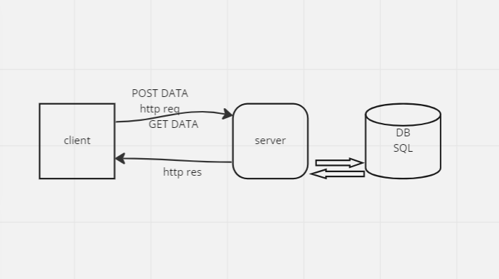

# Movies-Library
a movie app that can check the latest movies based on categoriest buildin with node.js [node.js](https://docs.npmjs.com/) and node express framework [exprese doc.](https://expressjs.com/)

**Author Name**: Abdelrahman Elatrash

## WRRC

## Overview
we  build a web application as a lebrary of movies classified by there categories
this part is show you a list of movies that we have with some description to let you choes what movies you want to show;
now our app working with 3rd party api we are fetching data from website THE MOVIE DB
(https://www.themoviedb.org/) , that's give us information about movies,trending movies,search movies and more

add movies to our database we are working on postgresql database(https://www.postgresql.org/)

## Getting Started
this backend part of our project

install dependences
all dependences are in `package.json` file  
run this comand in home directory Movies-Library it will install all dependences for project
npm install

start the server run comand in the Movies-Library directory
npm start
or 
npm run devStart

required api key 
create account and get api key from (https://www.themoviedb.org/)
then replace APIKEY VALUE with your value in [./server.js] file

## database
install postgre sql database (https://www.postgresql.org/)

create database called [movies]

in MOVIES-LIBRARY   directory run this command to create table
psql -d movies -f schema.sql

## Project Features
the projec will run on the localhost with port 3000
[home page](http://localhost:3000/);
**
GET http://localhost:3000/ 
the server response with data
{"title":"Spider-Man: No Way Home","poster_path":"/1g0dhYtq4irTY1GPXvft6k4YLjm.jpg","relase-date": 34-12-1987,"overview":"Peter Parker is unmasked and no longer able to separate his normal life from the high-stakes of being a super-hero. When he asks for help from Doctor Strange the stakes become even more dangerous, forcing him to discover what it truly means to be Spider-Man."}
**
[favert page](http://localhost:3000/favorite)
GET http://localhost:3000/favorite

the server response with data

"Welcome to Favorite Page"

**
'/trending' page
here you can get the trending movies 
['/trending' page](http://localhost:3000/trending)
GET http://localhost:3000/trending
response json
({
    "id":453,
    "title":"titanic",
    "relase-date": 34-12-1987,
    "overview":"story about movie and ...",
    "poster_path":"/1g0dhYtq4irTY1GPXvft6k4YLjm.jpg"
})

**
search a movie
'/search/:movie_name'
here you can search for a movie by movie name and will get all movies have samiler name
[/search](http://localhost:3000/search?movie={NAME OF MOVIE})
GET http://localhost:3000/search/{Ttitanc}

response json
({
    "id":453,
    "title":"titanic",
    "relase-date": 34-12-1987,
    "overview":"story about movie and ...",
    "poster_path":"/1g0dhYtq4irTY1GPXvft6k4YLjm.jpg"
})

get movies from our database 
GET http://localhost:3000/movies

response json
({
    "id":453,
    "title":"titanic",
    "relase-date": 34-12-1987,
    "overview":"story about movie and ...",
    "poster_path":"/1g0dhYtq4irTY1GPXvft6k4YLjm.jpg"
})

post new movies to database

POST http://localhost:3000/movies

body:{
    "title":"titanic",
    "relase-date": 34-12-1987,
    "overview":"story about movie and ...",
    "poster_path":"/1g0dhYtq4irTY1GPXvft6k4YLjm.jpg"
}
response 
data was added to DB